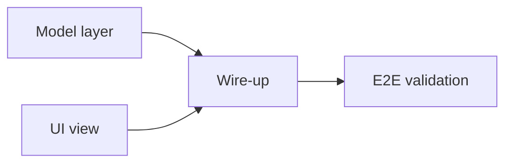

# symphony-planner

Break a feature into small, file-disjoint tickets that Symphony agents can work on in parallel.

## When to activate

User says something like "plan [feature] as tickets for Symphony" or "break this down into parallel tasks".

## Workflow

### 1 · Clarify (one round — ask all questions together)

Ask the following in a single message. Do not assume answers — wait for the user to respond before proceeding.

**Required:**
1. **What** — What exactly is being built or fixed? (one sentence is fine)
2. **Why** — What problem does it solve or what value does it add?
3. **Done means** — What does a fully working version look like to the user?

**Ticket metadata (ask explicitly — do not default silently):**
4. **Type** — Is this a `feature` (new capability), `bug` (something broken), or `improvement` (polish/enhancement)?
5. **Priority** — `urgent`, `high`, `medium`, or `low`?
6. **Milestone / cycle** — Should these tickets be attached to a specific Linear cycle or milestone? If yes, which one?
7. **Due date** — Is there a target date?
8. **Labels beyond `symphony`** — Any extra labels to add? (e.g. `ios`, `settings`, `payments`)
9. **Blocked by** — Does this depend on any existing ticket or PR being merged first?
10. **Constraints** — Hard constraints: platforms, feature flags, files to avoid, API limits.

### 2 · Discover

Launch up to 3 Explore agents in parallel to map the affected surfaces (views, models, services, tests). Output: file inventory grouped by surface area.

### 3 · Decompose

Break the feature into atomic units. Each unit must:
- Touch 3–8 files (hard cap: 15)
- Be completable in <2 h of Codex time
- Have exactly one acceptance criterion and one concrete validation step (build command, test, or screenshot)

### 4 · Dependency graph

For each unit list `dependsOn: [unit-ids]`. Render as a Mermaid diagram:



### 5 · Parallel cohorts

Topo-sort the graph. Group nodes with no inter-dependencies into cohorts. Within each cohort verify **file-disjointness** — no two tickets touch the same file. If they overlap, merge or push one to a later cohort. Default cap: 3 tickets per cohort.

### 6 · Confirm with user

Print:

```
Cohort 1 (parallel-safe): TICKET-A · TICKET-B · TICKET-C
Cohort 2 (needs cohort 1): TICKET-D · TICKET-E
Cohort 3 (needs cohort 2): TICKET-F
```

Plus the Mermaid graph and a one-line summary per ticket. **Wait for user to type `approve` before creating tickets.**

### 7 · Create tickets

For each unit, write the description to `/tmp/ticket-<id>.md` then run:

```bash
linear issue create \
  --team GAT \
  --assignee codex \
  --label symphony \
  --label <feature|bug|improvement> \
  [--label <extra-label> ...] \
  --priority <urgent|high|medium|low> \
  --state Todo \
  --project fece7a81a0a3 \
  [--due-date YYYY-MM-DD] \
  --title "<title>" \
  --description "$(cat /tmp/ticket-<id>.md)"
```

After creation, if the user specified a cycle/milestone:
```bash
linear cycle add <cycle-id> <issue-id>
```

Description file format:

```
<2–4 line plain-English summary of what this ticket does and why>

## Goal
<one sentence>

## Scope
<bullet list of files to touch>

## Acceptance Criteria
- [ ] <single criterion>

## Validation
- [ ] <concrete command or screenshot step>

## Depends on
<list of prerequisite ticket IDs, or "none">
```

### 8 · Delegate property updates via @linear agent

After tickets are created, any ticket property changes (state, priority, labels, assignee, due date, cycle, etc.) should be delegated to the `@linear` agent by posting a comment on the relevant ticket. Do **not** run `linear issue edit` CLI commands for updates — use the agent comment pattern instead.

**Comment syntax:**

```
@linear set state: In Progress
@linear set priority: urgent
@linear add label: blocked
@linear set assignee: codex
@linear set due date: 2026-06-01
@linear add to cycle: <cycle-id>
@linear remove label: symphony
```

**When to delegate to @linear:**
- A ticket's scope changes during implementation (add/remove files from Scope)
- A cohort ticket is unblocked and ready to move to `In Progress`
- A ticket is blocked by an unexpected dependency — add a `blocked` label and comment explaining why
- Priority changes based on new information
- A ticket needs to be split: close the original with `@linear set state: Cancelled` and reference the new ticket IDs in the comment

**Embedding delegation hints in ticket descriptions:**

When writing the description for each ticket, include a `## Agent Updates` section so Symphony agents know how to self-report progress:

```
## Agent Updates
Post a comment starting with `@linear` to update this ticket's properties.
Examples:
- Mark in progress: `@linear set state: In Progress`
- Mark done: `@linear set state: Done`
- Flag a blocker: `@linear add label: blocked` + explain in the same comment
```

## Built-in rules (always apply)

- Team: **GAT** · Assignee: **codex** · Label: **symphony** · State: **Todo**
- Description always starts with a short plain-English summary (not a header)
- iOS validation always uses `xcbeautify`, not grep filters
- Never create a ticket spanning >15 files — split first
- Never omit a `## Depends on` section even if the value is "none"
- Never create a ticket with no concrete validation step
- Never use `linear issue edit` for updates — always delegate to `@linear` via ticket comment

## Example — "Add CSV export"

| Cohort | Tickets | Notes |
|--------|---------|-------|
| 1 (parallel) | GAT-A: Model/serializer · GAT-B: Export button view · GAT-C: Unit-test scaffolding | File-disjoint |
| 2 (needs A+B) | GAT-D: Wire button to serializer · GAT-E: Share-sheet integration | |
| 3 (needs D+E) | GAT-F: E2E manual test + simulator screenshots | |

## Verification after ticket creation

1. Open Linear → GAT board → confirm all tickets have `symphony` label, `codex` assignee, `Todo` state.
2. Run `symphony` (alias for `cd ~/ai_projects/symphony/elixir && ./run.sh`) — Symphony picks up Cohort 1 concurrently (up to 10 agents).
3. Cohort 2 tickets stay in `Todo` until Cohort 1 PRs are merged and the human moves them forward.
4. Use `@linear` comments on tickets to update properties as work progresses — do not edit via CLI.
